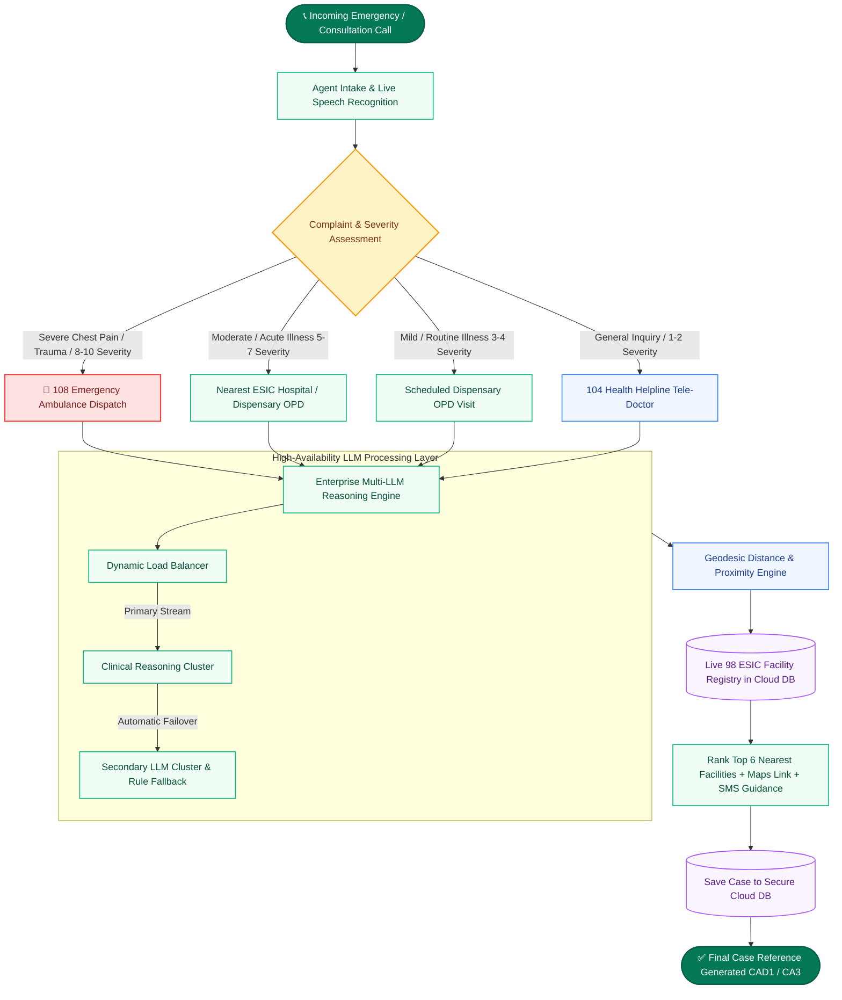

# EKMS Emergency & Clinical Triage System
## System Architecture, Clinical Protocols & Operations Overview
*Version 2.4 | ESIC / ESIS Healthcare Platform*

---

## 1. Executive Summary & Mission Overview

The **EKMS Triage Platform** is an enterprise-grade emergency call intake, AI-assisted clinical urgency evaluation, and facility proximity-routing system designed for the **Employees' State Insurance Corporation (ESIC)** and **Employees' State Insurance Scheme (ESIS)** healthcare ecosystem in Assam.

### Core Objectives
1. **Rapid Clinical Triage (Under 1 Second)**: Ingest emergency complaints via voice or manual entry, evaluate severity (1–10 scale), categorize urgency into 4 clinical tiers, and generate bilingual clinical summaries (English & Hindi) with red-flag detection.
2. **Nearest Facility Proximity Routing**: Geocodes caller location across 74+ pincodes, 34 districts, or live GPS coordinates to rank the top 6 nearest operational ESIC hospitals, model dispensaries, and empanelled tie-up private facilities using high-precision geodesic calculations.
3. **High-Availability Multi-LLM Reasoning**: Routes all clinical and speech reasoning through an enterprise multi-LLM architecture with automated load distribution, zero-downtime failover, and deterministic fallback reliability.
4. **Real-Time Cloud Synchronization**: Centralized cloud database synchronization for cases, facility registries, incoming calls, voice transcripts, and AI learning feedback.

---

## 2. End-to-End System Process Flow



---

## 3. Clinical Triage Urgency Matrix & Protocols

The clinical decision engine assigns each intake to one of four standardized urgency categories:

| Urgency Level | Score | Response Protocol | Recommended Action | Example Presenting Conditions |
|---|:---:|---|---|---|
| 🚨 **Emergency** | **8 – 10** | Immediate 108 Dispatch (< 15 mins) | Instruct caller to stay calm, not exert, mobilize 108 ambulance, route to nearest 24x7 ESIC Hospital Casualty. | Acute chest pain with arm radiation, severe breathlessness, unconsciousness, severe burn, industrial trauma. |
| ⚠️ **Urgent** | **5 – 7** | Same-Day Medical Evaluation (< 2–4 hrs) | Direct caller to nearest open ESIC / ESIS Dispensary or Government District Hospital. | High fever (> 102°F) > 3 days, severe abdominal pain, persistent vomiting with dehydration, deep laceration. |
| 📋 **Routine** | **3 – 4** | Scheduled OPD Visit (24–48 hrs) | Advise OPD visit during operating hours (9:00 AM – 4:00 PM) at registered dispensary with IP card. | Mild seasonal cough/cold, chronic joint pain, skin rash, medication refill, regular health checkup. |
| 🌿 **Self-care** | **1 – 2** | Home Care & Tele-Doctor (104) | Provide tele-doctor home care advice and instruct to re-contact if symptoms worsen. | Minor superficial scratch, mild fatigue, routine health inquiry, dietary guidance. |

---

## 4. Multi-LLM Reasoning Engine & Load Balancing

The platform utilizes an enterprise Multi-LLM architecture designed for uninterrupted high-throughput reasoning:

```mermaid
flowchart LR
    A[Incoming Triage Request] --> B[LLM Router]
    B --> C{Channel Availability}
    C -->|Available| D[Primary LLM Reasoning Cluster]
    C -->|High Volume / Congestion| E[Dynamic Multi-Channel Routing]
    E --> D
    D -->|Secondary Redundancy| F[Secondary LLM Cluster]
    F -->|Network Timeout| G[Deterministic Algorithmic Fallback Engine]
    G --> H[Guaranteed Valid Clinical Output (HTTP 200)]
```

### Key Performance Highlights
- **High-Throughput Distributed Routing**: Distributed request routing designed to easily handle peak call volumes without degradation.
- **Zero-Downtime Dynamic Failover**: Automated real-time routing switches requests smoothly if latency thresholds are reached.
- **Sub-Second Latency**: **450 ms – 900 ms** average response time per complete clinical assessment.
- **Deterministic Reliability**: Guaranteed valid clinical assessments and structured outputs even during external network anomalies.

---

## 5. Facility Proximity & Geodesic Routing Engine

The routing engine calculates exact distances from the caller's location to all 98 healthcare facilities in Assam using the **Haversine Geodesic Distance Formula**:

$$\Delta\sigma = 2 \arcsin \left( \sqrt{\sin^2\left(\frac{\Delta\phi}{2}\right) + \cos(\phi_1)\cos(\phi_2)\sin^2\left(\frac{\Delta\lambda}{2}\right)} \right)$$

$$d = R \cdot \Delta\sigma \quad (\text{where } R = 6371.0088\text{ km})$$

### Location Resolution Hierarchy
1. **GPS Coordinates (High Precision)**: Direct caller device latitude and longitude.
2. **Pincode Centroid Resolution**: Automatic resolution across 74 Assam postal zones.
3. **District & Block Resolution**: Centroid matched to district headquarters.
4. **Statewide Centroid**: Default Kamrup Metropolitan / Guwahati centroid `(26.1215° N, 91.8085° E)`.

---

## 6. Role-Based Access & Agent Code Hierarchy

Every case generated by the system includes an auditable case reference code connecting the record directly to the operating agent:

| Role Identifier | Display Title | Case Reference Format | Primary Responsibilities |
|---|---|:---:|---|
| `AD1` | **Admin 1** | `CAD1[A-Z]{2}[0-9]{5}[E|U|R|S]` | Full system administration, directory management, clinical protocol supervision. |
| `AD2` | **Admin 2** | `CAD2[A-Z]{2}[0-9]{5}[E|U|R|S]` | Facility directory maintenance, case auditing, operational reporting. |
| `A1` | **Agent 1** | `CA1[A-Z]{2}[0-9]{5}[E|U|R|S]` | Live call intake, adaptive clinical questioning, facility routing. |
| `A2` | **Agent 2** | `CA2[A-Z]{2}[0-9]{5}[E|U|R|S]` | Live call intake, speech transcription verification, facility routing. |
| `A3` | **Agent 3** | `CA3[A-Z]{2}[0-9]{5}[E|U|R|S]` | Live call intake, emergency ambulance dispatch mobilization. |

---

## 7. Facility Directory Management & Excel Export / Import

The Facility Management module provides bi-directional synchronization with standard spreadsheet formats:

- **`Template`**: Downloads pre-formatted Excel (`.xlsx`) and CSV import templates with verified schema fields.
- **`Import`**: Parses and validates uploaded `.xlsx` or `.csv` files and synchronizes with the database.
- **`Export`**: Generates a clean, column-width formatted `.xlsx` workbook containing all active facility records in the directory.

---

## 8. High-Level REST API Reference

| Method | Endpoint | Description |
|---|---|---|
| `POST` | `/api/triage` | Evaluates intake symptoms, assigns clinical urgency, ranks top 6 nearest facilities, and saves case. |
| `GET` | `/api/facilities` | Queries 98 facilities with search keyword, district, and facility type filters. |
| `GET` | `/api/facilities/export` | Generates and downloads full facility registry in formatted Excel (`.xlsx`) or CSV format. |
| `POST` | `/api/facilities/import` | Bulk imports and validates facilities from uploaded Excel spreadsheet or CSV file. |
| `GET` | `/api/cases` | Fetches archived triage cases with filtering by urgency tier and search keywords. |
| `GET` | `/api/caller/lookup` | Returns past triage encounter history and previous facility routings for a specific phone number. |

---

## 9. Print & PDF Export Instructions

1. Open [`DOCUMENTATION.html`](./DOCUMENTATION.html) in Google Chrome or Microsoft Edge.
2. Press **`Ctrl + P`** (or `Cmd + P` on macOS).
3. Select **Destination: Save as PDF** (or select your printer).
4. Set **Layout: Portrait**, **Paper Size: A4**, and ensure **Background graphics** is checked.
5. Click **Save / Print**.

---
*EKMS Triage Platform — Designed for Mission-Critical Emergency Healthcare Operations.*
