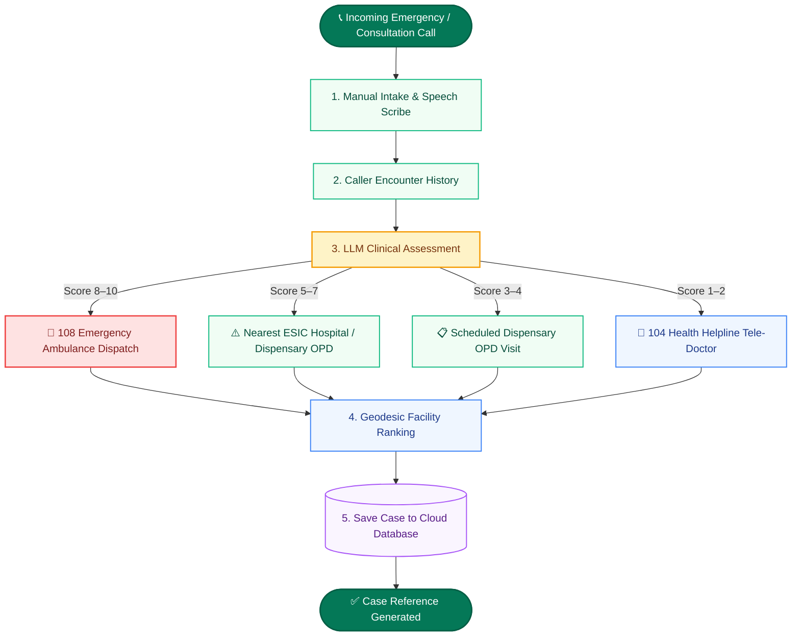

# EKMS Emergency & Clinical Triage Platform
## System Architecture, Clinical Triage Protocols & Operations Manual
*ESIC Care Coordination Centre in Assam*

---

## 1. Executive Summary & Mission Overview

The **EKMS Triage Platform** is an enterprise clinical decision support and proximity-routing engine designed to streamline emergency intake, patient severity assessment, and facility navigation for the **ESIC Care Coordination Centre in Assam**.

### Core System Capabilities
- **Sub-Second Clinical Triage**: Evaluates reported symptoms, assigns standardized urgency tiers (1 to 10 severity scale), and generates bilingual summaries (English & Hindi) in real time.
- **Intelligent LLM Reasoning Engine**: Employs an enterprise high-availability multi-LLM architecture with automatic load balancing and zero-downtime failover.
- **Geodesic Proximity Engine**: Real-time Haversine distance ranking across ESIC/ESIS hospitals, dispensaries, Govt Hospitals, and empanelled private tie-up facilities.
- **Real-Time Cloud Synchronization**: Centralized cloud database synchronization for cases, facility directory, caller history, and multi-agent coordination.

---

## 2. End-to-End Operational Workflow

### Sequential Operations Pipeline
1. **Manual Intake & Speech Scribe**: Primary focus on rapid manual typing by agent with continuous speech recognition assistance (Hinglish/Hindi/English) and demographic capture.
2. **Caller Encounter History**: Automatic query matches caller contact number with past recorded triage encounters, previous routings, and chronic health history.
3. **LLM Clinical Assessment**: The LLM reasoning engine assesses clinical urgency (1–10 score), isolates red-flag symptoms, and generates bilingual clinical summaries.
4. **Geodesic Facility Ranking**: Caller coordinates / PIN code resolved against registered facilities via Haversine geodesic calculation to rank the top 6 nearest centers.
5. **Case Archival & Dispatch Action**: Case saved to secure cloud database with unique reference code. Caller provided with SMS address, turn-by-turn Maps link, or immediate 108 ambulance dispatch.

---

## 3. Clinical Urgency Matrix & Triage Protocols

| Urgency Level | Score | Clinical Protocol | Recommended Action | Representative Symptoms (prototype) |
|---|:---:|---|---|---|
| 🚨 **Emergency** | **8 – 10** | Immediate 108 Emergency Dispatch (< 15 mins) | Mobilize 108 Ambulance; instruct caller to remain calm and avoid exertion; route directly to nearest 24x7 Hospital Casualty. | Acute severe chest pain, radiating arm pain, cold sweating, acute breathlessness, unconsciousness, major trauma. |
| ⚠️ **Urgent** | **5 – 7** | Same-Day Clinical OPD Evaluation (< 2–4 hrs) | Direct patient to nearest operational ESIC / ESIS Dispensary or Government Civil Hospital during OPD hours. | High persistent fever (> 102°F) > 3 days, severe abdominal pain, persistent vomiting with dehydration, deep lacerations. |
| 📋 **Routine** | **3 – 4** | Scheduled Dispensary OPD Visit (24–48 hrs) | Advise regular visit to registered Dispensary (Mon-Fri 9AM-4PM, Sat 9AM-1PM) with insured person credentials. | Mild seasonal viral symptoms, localized joint aches, chronic prescription refills, regular health checkups. |
| 🌿 **Self-care** | **1 – 2** | Home Care & Tele-Doctor Guidance (104) | Provide telephonic home care guidance and transfer to 104 Tele-Doctor helpline if consultation is requested. | Minor superficial scratches, mild fatigue, general health queries, preventive wellness inquiries. |

---

## 4. Enterprise Multi-LLM Reasoning Engine

The platform employs an enterprise Multi-LLM architecture with automated load balancing designed for high-availability clinical reasoning:

- **Continuous High Throughput**: Distributed multi-channel request routing designed to handle peak call volumes without degradation.
- **Instant Dynamic Failover**: Automated routing switches requests seamlessly if latency thresholds are encountered.
- **Multi-Tier Redundancy**: Primary LLM reasoning clusters are backed by secondary LLM models and a deterministic algorithmic fallback engine.
- **Deterministic Reliability**: Guaranteed valid clinical assessments and structured outputs even during unexpected external network disruptions.

---

## 5. Facility Proximity & Geodesic Distance Engine

Distances are computed in real time from the caller's resolved location to healthcare facilities in Assam using the **Haversine Geodesic Distance Formula**:

$$d = 2 \cdot R \cdot \arcsin\left(\sqrt{\sin^2\left(\frac{\Delta\phi}{2}\right) + \cos(\phi_1)\cos(\phi_2)\sin^2\left(\frac{\Delta\lambda}{2}\right)}\right)$$

$$\text{Where } R = 6371.0088\text{ km (Earth's mean radius)}, \quad \phi = \text{Latitude}, \quad \lambda = \text{Longitude}$$

### Location Resolution Fallback Hierarchy
1. **Tier 1 — Pincode Centroid**: Matched across Assam postal zones for accurate local centroid mapping.
2. **Tier 2 — District Centroid**: Resolved to district headquarters if pincode is unspecified.
3. **Tier 3 — State Centroid**: Guwahati / Kamrup Metro central fallback coordinate.

---

## 6. How to Print & Save as PDF

1. Open [`DOCUMENTATION.html`](./DOCUMENTATION.html) in Google Chrome or Microsoft Edge.
2. Click the green **"🖨️ Print / Save as PDF"** button (or press `Ctrl + P`).
3. Under **More settings**, uncheck **"Headers and footers"** (to remove browser URLs/dates).
4. Set **Paper size: A4**, **Layout: Portrait**, and check **"Background graphics"**.
5. Click **Save as PDF**.
